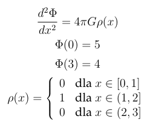
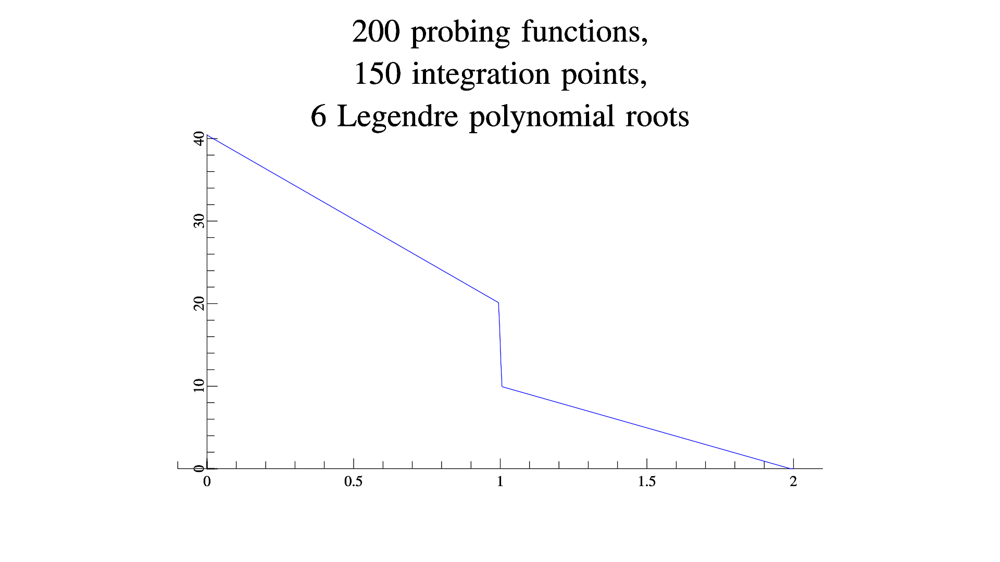

# MES-Solver
Finite element method solver for a gravitational field differential equation.

This software solves a gravitational field differential equation problem using the finite elements method.

Please note that this problem is mathematically wrong - two "valid" solutions exist, depending on the approach.

An example solution looks like this (refer to the .pdf file for explanation and derivation of the solution):

